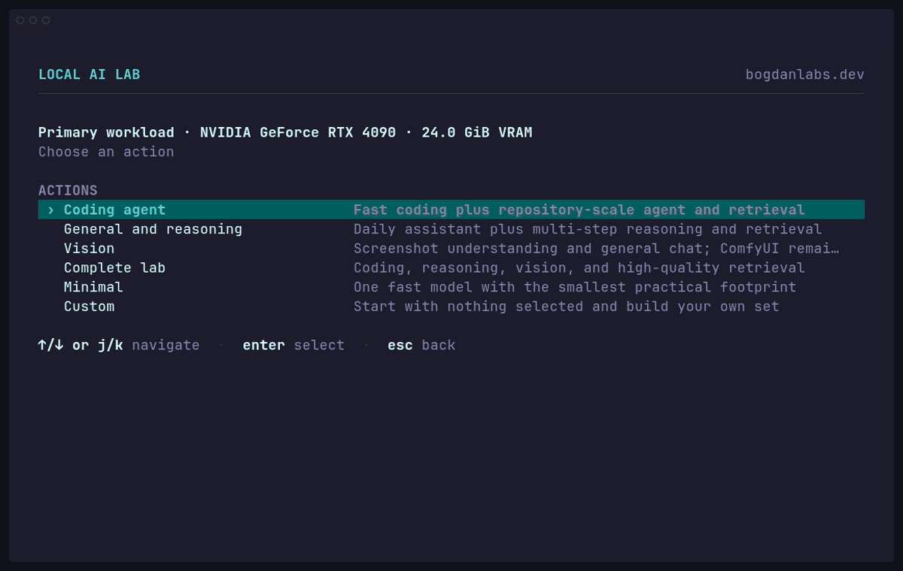

<div align="center">

<h1>Local AI Lab</h1>

<p><strong>Terminal-first control center for a private local AI workstation.</strong></p>

<p>Models, coding agents, web search, workspace knowledge, images, and monitoring. No paid API required.</p>

<p>By <a href="https://github.com/master-bogdan">Bogdan Shchavinskyi</a> at <a href="https://bogdanlabs.dev">bogdanlabs.dev</a>.</p>

<picture>
  <source media="(prefers-reduced-motion: reduce)" srcset="assets/tui-models.png">
  
</picture>

</div>

## Install

Download and run the native installer for your host. It is a self-contained Go binary with no runtime dependency.

Linux amd64:

```bash
curl -fsSL https://github.com/master-bogdan/local-ai-lab/releases/latest/download/local-ai-lab-installer_linux_amd64 -o /tmp/local-ai-lab-installer
chmod 700 /tmp/local-ai-lab-installer
/tmp/local-ai-lab-installer
```

Linux ARM64:

```bash
curl -fsSL https://github.com/master-bogdan/local-ai-lab/releases/latest/download/local-ai-lab-installer_linux_arm64 -o /tmp/local-ai-lab-installer
chmod 700 /tmp/local-ai-lab-installer
/tmp/local-ai-lab-installer
```

Apple Silicon macOS:

```bash
curl -fsSL https://github.com/master-bogdan/local-ai-lab/releases/latest/download/local-ai-lab-installer_darwin_arm64 -o /tmp/local-ai-lab-installer
chmod 700 /tmp/local-ai-lab-installer
/tmp/local-ai-lab-installer
```

The installer shows the exact version, platform, application path, and command path before writing. It verifies SHA-256 checksums and also verifies GitHub release integrity and build provenance when `gh` is available. It installs only the control center; no model or service starts automatically.

Launch it from any directory:

```bash
local-ai-lab
```

## Requirements

| Host | Minimum | Status |
|---|---|---|
| Linux amd64 with NVIDIA or AMD GPU | 6 GiB VRAM, 16 GiB RAM | supported |
| Linux amd64 with Vulkan-capable AMD or Intel GPU | 6 GiB VRAM, 16 GiB RAM | experimental |
| Linux ARM64 with a supported GPU runtime | service-dependent | experimental |
| Apple Silicon macOS | 24 GiB unified memory | supported |

Fedora, Ubuntu, and Arch Linux are supported. CPU-only systems, Intel Macs, Windows, and WSL are rejected. GPU drivers must already work on the host. Linux setup can install Docker and supported container runtime packages after showing exact commands and receiving confirmation. macOS requires Homebrew and Docker Desktop.

## Use

First run checks hardware and disk, recommends models for the detected memory, and lets you confirm every model, service, path, and system change. Installation ends with all services stopped. Start the workload you need from the control center afterward.

Main actions:

- start or switch coding, image, infrastructure, or combined workloads
- inspect service health and localhost URLs
- follow logs and manage Ollama models
- configure ComfyUI, monitoring, and OpenCode
- index a Git workspace for local agent search
- update or roll back the Local AI Lab application
- stop services or uninstall with a reviewed deletion plan

Services can remain running after the TUI exits. Exit flow asks whether to keep them running or stop them. Reopen `local-ai-lab` later to inspect or stop them.

## Included Tools

| Tool | Purpose |
|---|---|
| Ollama | local model runtime |
| OpenCode | terminal coding agent; installed separately, configured by the TUI |
| Open WebUI | browser chat and local RAG |
| SearXNG | local web-search gateway |
| Qdrant | workspace vector search |
| ComfyUI | separate image-generation flow |
| Prometheus, Grafana, cAdvisor | predefined metrics, alerts, and dashboard |

Model picker labels each model `FAST`, `TIGHT`, `HYBRID`, or `UNSUPPORTED`, explains why, and sizes context for available memory. Presets remain small; custom setup exposes the full curated catalog. A preserved reinstall receipt can restore model and service choices after a full uninstall, but never stores secrets, prompts, search history, logs, or indexed workspace paths.

## Local Data

Default root:

- Linux: `${XDG_DATA_HOME:-~/.local/share}/local-ai-lab`
- macOS: `~/Library/Application Support/local-ai-lab`

Application versions, configuration, models, indexes, cached searches, generated images, service data, and monitoring history remain local. Services bind to `127.0.0.1`; other processes running as your user can still access localhost APIs. Web searches and downloads use the internet.

Choose **Application** -> **Uninstall** for application-only removal, full removal with reinstall choices preserved, or absolute removal. Docker, GPU drivers, Homebrew, native apps, and shared upstream container images are never removed.

## Development

From a source checkout:

```bash
make start
make test
```

`make start` builds a repository-local development binary and uses the same lab data as an installed release. It does not install a global command.

## License

Local AI Lab source and configuration are MIT licensed. See [LICENSE](LICENSE). Downloaded models, containers, applications, and dependencies retain their upstream licenses.
